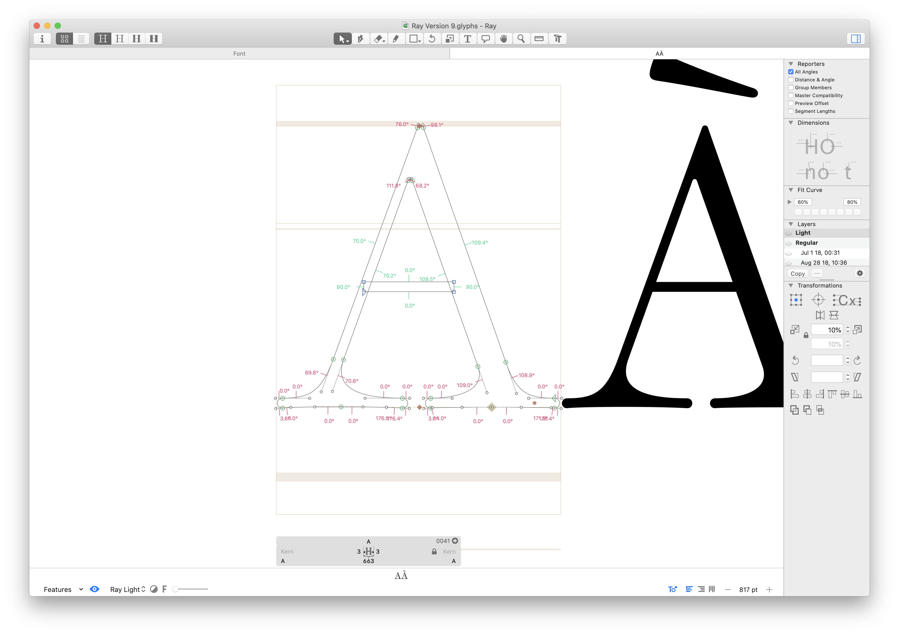
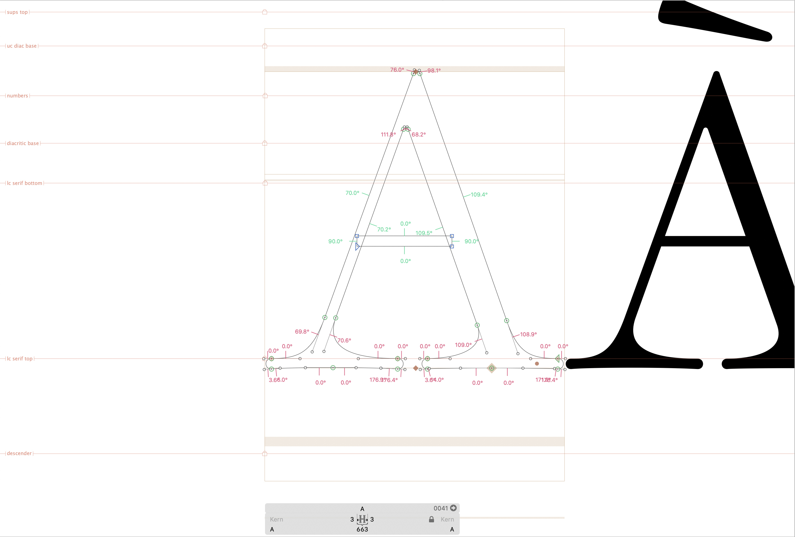
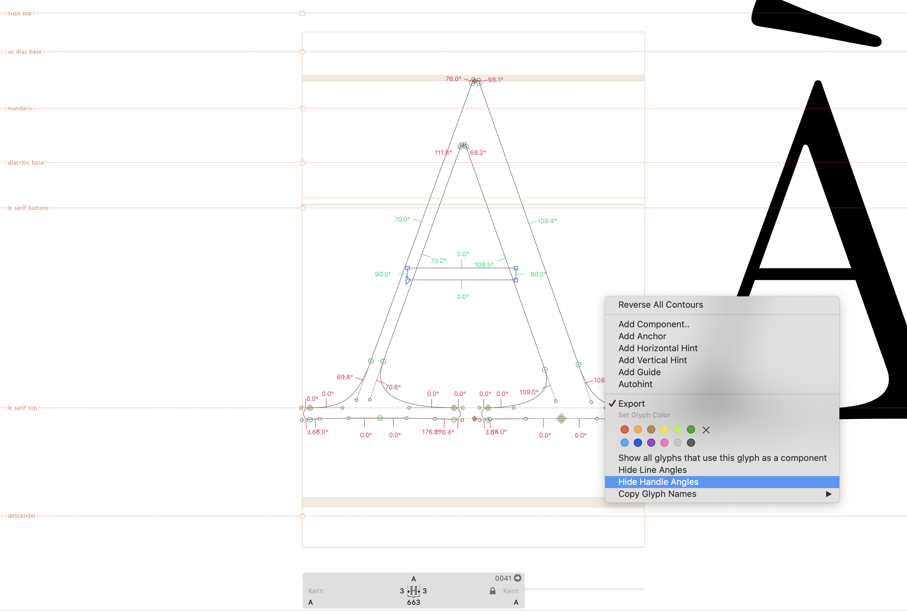

# All Angles Glyphs Reporter Plugin

**It’s the Occupant Fonts All Angles Reporter Plugin!** This Glyphs reporter shows the angle from the horizontal of all straight lines in the active layer of the current Glyphs tab. This includes straight line segments, and the handles	of curves. Angles are given to 0.1 degree of precision. All indicators can be toggled	on and off in the context (right-click) menu, while the reporter is active. You can also assign a keyboard shortcut in the Glyphs settings to View > Show All Angles.

## Installation

To install the plugin:

1. Clone this repository to any workspace on your computer. Wherever you usually keep your scripts / plugins is probably fine.

2. Navigate to the cloned folder in your Finder window, and double-click on the `AllAngles.glyphsReporter` file. A window should pop up, asking if you want to install the plugin.

3. Accept the installation.

4. Ideally, Glyphs will also detect that the plugin is part of a git repository (if you download, rather than clone the repository, this will not happen). It will ask you if you want it to make a Finder Alias to the directory where you downloaded the plugin. Hit “use alias”, or whatever the appropriate affirmative response is. This way, when we push updates, all you need to do is pull and restart Glyphs.

5. Restart Glyphs.

You should be good to go. The reporter should show up in the main menu as **Show All Angles**, and **All Angles** in the Reporter Toggler, if you have that plugin installed.

## Usage

Toggle the reporter and look at a glyph’s outlines to see the indicators.

By default, `All Angles` only shows you the line angles, and not the handle angles. You can toggle both the line angles and handle angles on and off in the context menu, to control how much information you're seeing.

## Bugs, Improvements, and Requests

Bugs and feature requests can be registered as issues on this Github repository.
